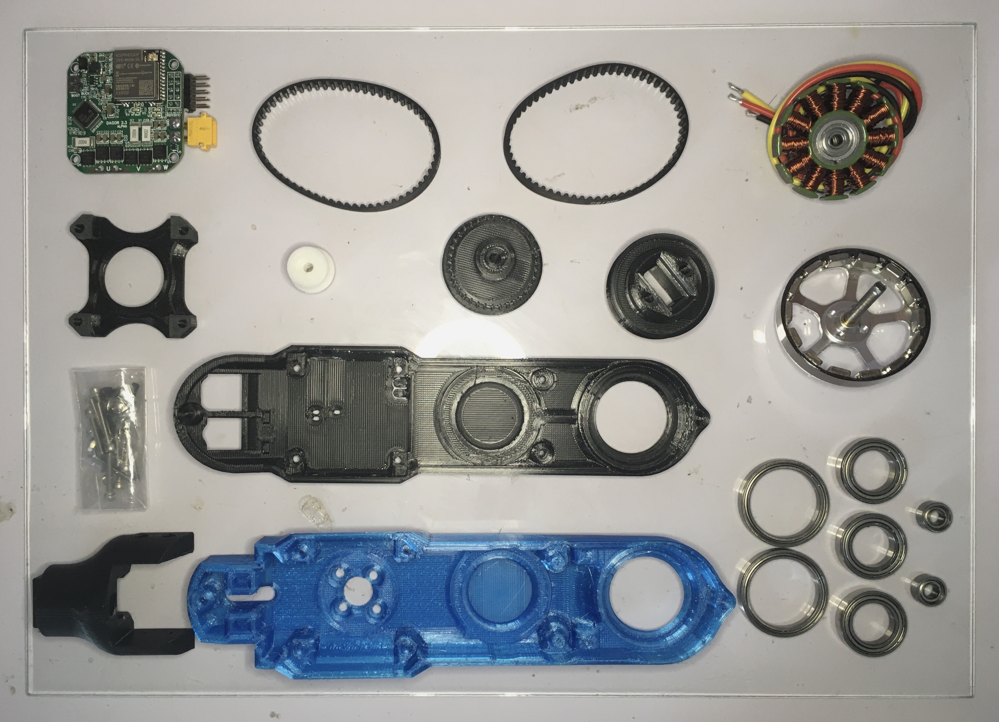

# Brushless Motor Actuator Module
Fully 3D-printed brushless-based actuator module for robotics with wireless connectivity.

## BOM:

| Component                  | Amount | Unit Weight [g] |
|----------------------------|--------|-----------------|
| 5010 360KV Motor           | 1      | 84              |
| Dagor Brushless Controller | 1      | 12              |
| u.fl Antenna		     | 1      | 0.75		|
| Diametrical magnet         | 1      | 1               |
| HTD 3M 180mm Belt	     | 2      | 2		|
| Bearing 6705 25x32x4       | 2      | 6.9             |
| Bearing 5x10x5	     | 2      |	2 	        |
| Bearing 6802 15x25x5	     | 3      | 7               |
| M2.5 x 20mm Screw	     | 4      | 0.666           |
| M2.5 x 15mm Screw          | 4      | 0.56            |
| M2.5 x 10mm Screw          | 1      | 0.45            |
| M2.5 Nut		     | 9      | 0.125		|
| Motor Screw		     | 4      | 0.75		|
| Pulley A		     | 1      | 2		|
| Pulley B		     | 1      | 7		|
| Pulley C		     | 1      | 9		|
| Pulley A Secure Plate	     | 1      | 5		|
| Shell			     | 1      | 46 		|
| Shell Cap		     | 1      | 24		|
| 90 Degree Connector	     | 1      | 13		|

